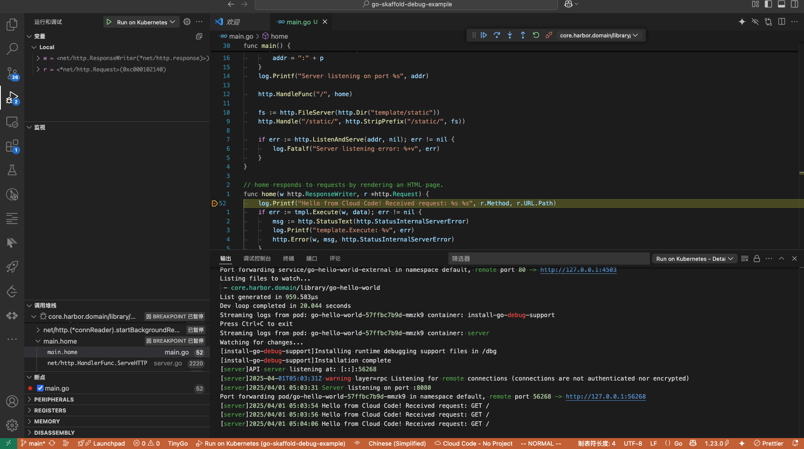

# Kubernetes Local Development Example with Cloud Code in VS Code

# Usage
1. Install the [Cloud Code](https://marketplace.visualstudio.com/items?itemName=GoogleCloudCloudCode) extension in VS Code.
2. Install the skaffold CLI tool
3. Change the private docker registry `core.harbor.domain` in the `skaffold.yaml` AND `launch.json` AND yaml files in `kubernetes manifests`directory  to your own private docker registry.
4. Run the `Run on Kubernetes` command from the development menu in VS Code Or Click the Debug Button in the Cloud Code extension.